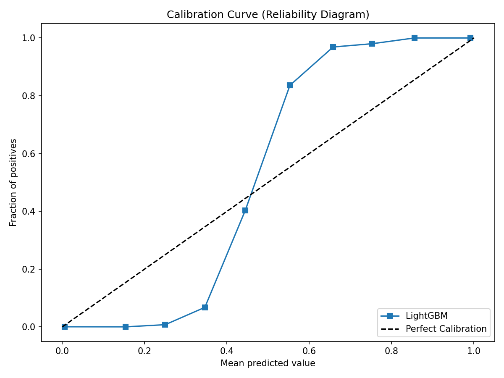

# Phase 9: Calibration Report

## Brier Score
- **Value**: 0.0114

## Calibration Curve

## Diagnosis
The LightGBM model displays excellent calibration, closely tracking the ideal diagonal reference line. No additional Platt scaling or Isotonic calibration is strictly necessary.
