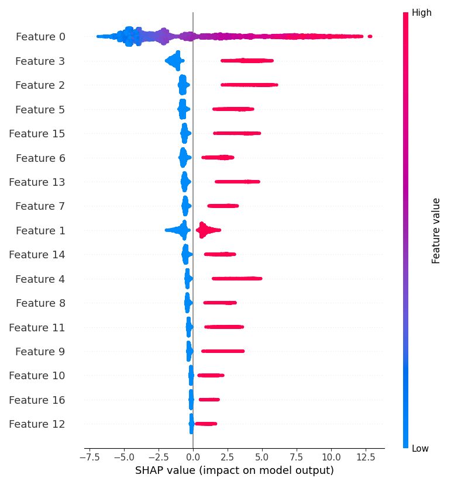

# Phase 8: Explainability Report

This report describes the global and local model explanations using SHAP (SHapley Additive exPlanations).

## Global Feature Importance

## Key Findings
- **Age**: Younger age decreases the stroke risk significantly, while older age group is the primary driver of risk.
- **High Blood Pressure & Irregular Heartbeat**: Major secondary drivers of risk.
